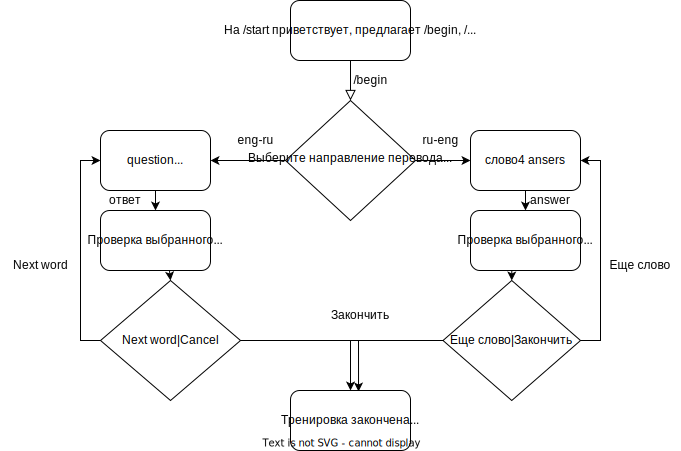
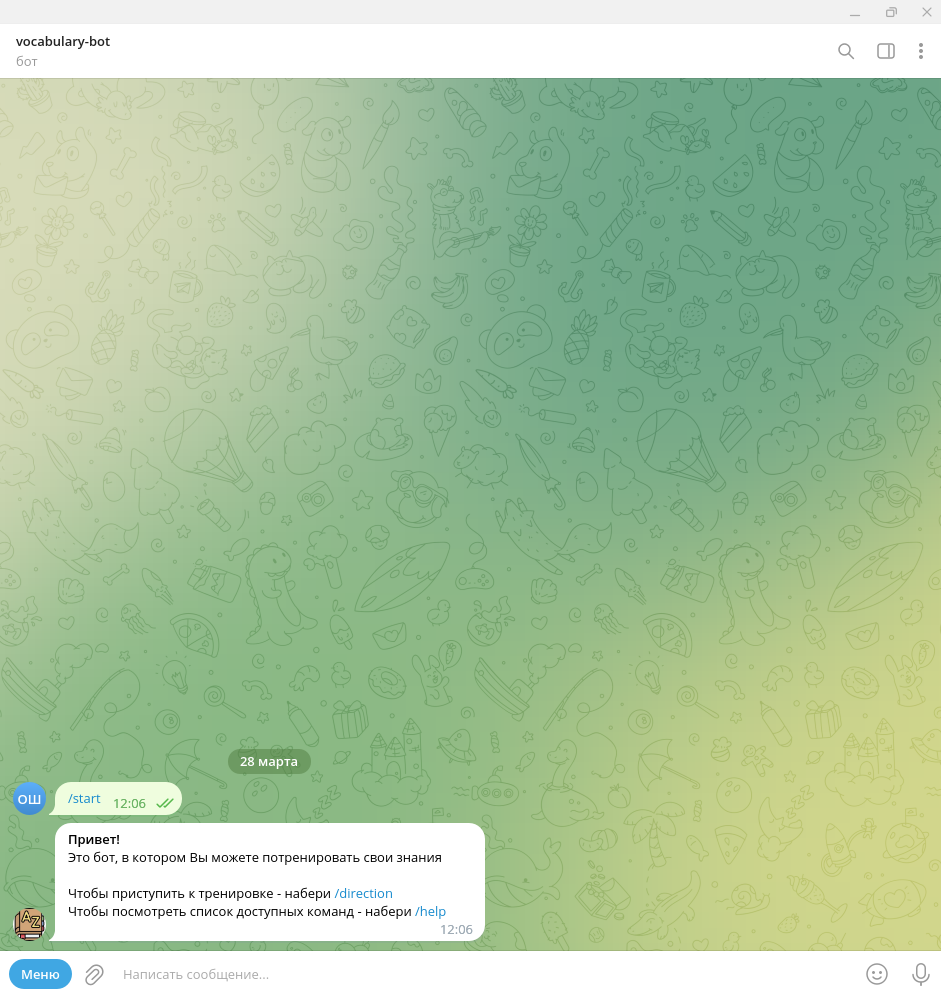
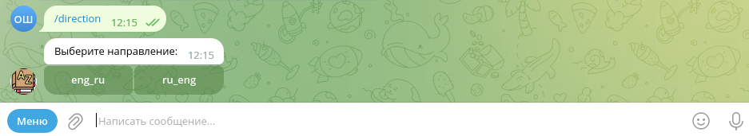
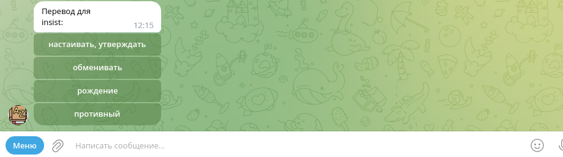
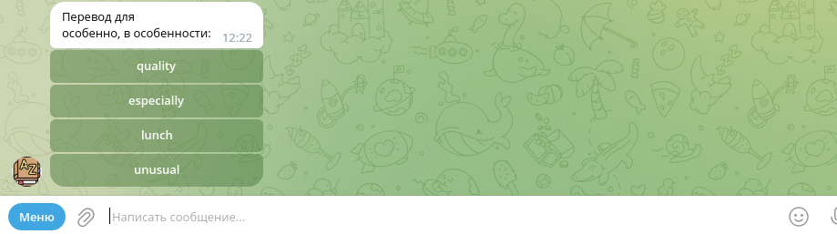
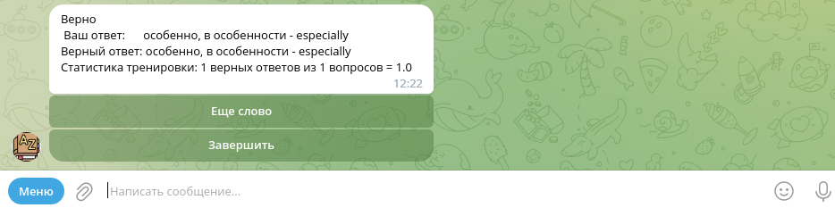

# vocabulary_bot
## Идея программы 
Программа, взаимодействующая с API Telegram, которая предназначена для тренировки словарного запаса пользователя. 
Тренировка осуществляется через отправку пользователю сообщения на одном языке и 4-х вариантов перевода на другой язык 
(один из ответов правильный). После выбора пользователем варианта перевода осуществляется проверка. В этом проекте для 
подготовки  словаря использован текстовый файл на 2000 слов, можно использовать более объемные исходные данные.
## Описание программы
Программа написана на языке python3.11 с использованием библиотеки aiogram 3.x - асинхронный python фреймворк 
для создания telegram-ботов
## Порядок использования программы
Блок-схема функционирования бота:  
1. В Телеграм пользователь через поиск находит vocabulary-bot.
2. Далее пользователь отправляет команду /start боту (или стартует его в Меню, пользуясь кнопкой /start):

3. Бот приветствует пользователя, сообщает: 
«Привет! Вы можете потренировать свои знания. 
Чтобы приступить к тренировке - набери /direction 
Чтобы посмотреть список доступных команд - набери /help»:

4. Команда /direction выводит 2 инлайн-кнопоки с направлениями перевода:
'eng-ru' - с английского слова на русский и 'ru-eng' русского слова на английский:

5. После выбора направления перевода (нажатия инлайн-кнопки) предлагается вариант перевода (вопрос) и 4 варианта ответа,
включая верный, в виде инлайн-кнопок с соответствующими записями:

или

6. После нажатия кнопки с ответом, он проверяется, выводится результат (верно/неверно вместе с правильным ответом). 
Одновременно изменяется и выводится статистика тренировки пользователя и 2 инлайн кнопки 
«Еще слово» и «Завершить»:

7. После кнопки «Еще слово» повторяется п. 3 - предлагается вариант перевода (вопрос) и 4 варианта ответа, 
включая верный, в виде инлайн-кнопок с соответствующими записями. И далее п.4.
8. После кнопки «Завершить» выводится: «Тренировка окончена. Ваш результат» — статистика
9. Если пользователь отправляет в чат любое текстовое сообщение, кроме /start или кнопки:
Бот реагирует эхом
  